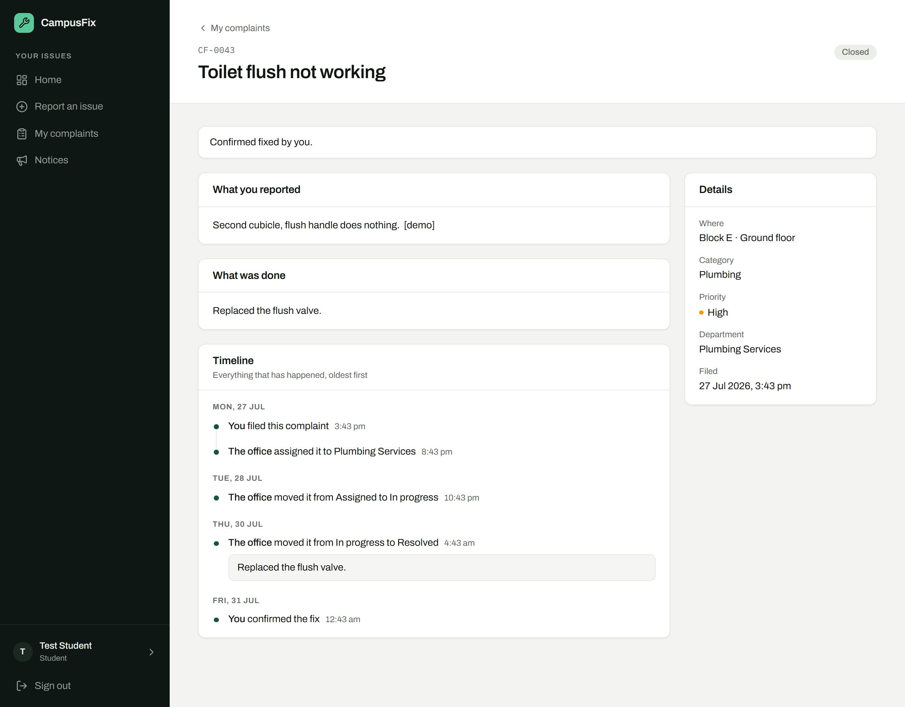
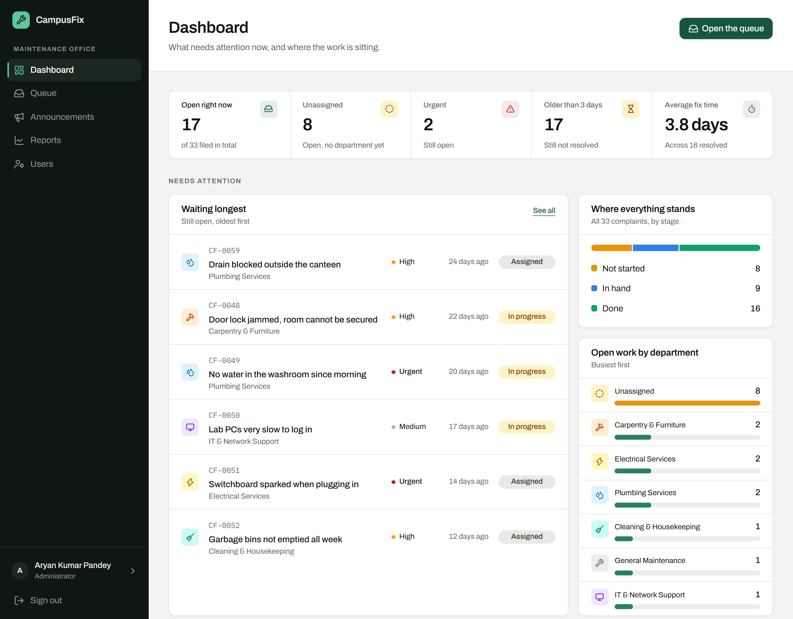

# CampusFix

**Campus complaints that do not get lost.**

A broken fan, a blocked drain, a lift that has been out for a week — on most
campuses these are reported to a register, a phone number or a WhatsApp group.
Nobody can tell you who has it, whether anything has happened, or whether the
same tap has broken four times this year.

CampusFix gives every complaint an owner, a clock and a record.

[](https://campusfix-pro.vercel.app)

## Try it

Sign in as any of these. The same complaint looks different to each of them,
which is the point.

| Role | Email | Password |
|---|---|---|
| Student | `student@campusfix.app` | `CampusFix#Test1` |
| Maintenance office | `admin@campusfix.app` | `CampusFix#Test1` |
| Department | `electrical@campusfix.app` | `CampusFix#Test1` |


## How it works

A student reports the problem with a photo and gets a ticket number. The
maintenance office assigns it to a department. The department starts the work,
and writes down what they actually did. The student then confirms the fix — or
sends it back with a reason, and it returns to the office.

Five states, always in the same order:

```
open  →  assigned  →  in progress  →  resolved  →  closed
```

Every one of those steps is saved with who did it and when, so "what happened to
my complaint?" always has an answer.



## Who uses it

| | |
|---|---|
| **Student** | Files a complaint, follows it, and is the only one who can close it |
| **Maintenance office** | Sees every complaint, routes it to a department, watches what is ageing |
| **Department** | Sees only its own work — starts it, resolves it, or hands it back |



## The parts that matter

**The student has the last word.** An admin can mark a complaint resolved, but
only the person who reported it can close it. If it is not actually fixed, they
send it back and it reopens.

**Nothing happens off the record.** Every status change writes a timeline entry
in the same database transaction as the change itself, so a complaint cannot
move without leaving a trace.

**The rules are enforced in the database, not in the screens.** Who can read
which complaint, and which status changes are legal, are checked inside
Postgres. Hiding a button is not security — someone can always call the API
directly, and the answer has to be the same.

**Photos stay private.** They are never public links. Each one is served through
a short-lived signed URL, so only the student who filed it, the office, and the
department holding the job can open it.

**It spots repeat faults.** Because every complaint carries a place and a
department, the reports show which places break most often and which departments
are slowest. A paper register cannot answer that.

## Built with

| | |
|---|---|
| **Next.js 16** — App Router | Pages render on the server, so the browser never holds a database credential and the first paint already has its data |
| **TypeScript** | The five statuses and three roles are union types, so an impossible state fails at compile time instead of in front of a student |
| **Supabase** — Postgres | Database, authentication and file storage behind one set of keys, and row-level security is what lets the access rules live in the database instead of the UI |
| **Tailwind CSS** | Styles sit beside the markup they apply to, so a screen can be read without hunting through a stylesheet |
| **Recharts** | The reports draw as SVG, so the charts stay sharp at any size and print cleanly |
| **Vercel** | Builds and deploys from the repository on every push |

## Running it locally

**1.** Install and start:

```bash
npm install
npm run dev
```

**2.** Create a Supabase project and put its keys in `.env.local`:

```
NEXT_PUBLIC_SUPABASE_URL=
NEXT_PUBLIC_SUPABASE_ANON_KEY=
```

**3.** Apply `supabase/migrations/*.sql` in order, in the Supabase SQL editor.
`0009_demo_seed.sql` is sample data and can be skipped.

**4.** In the Supabase dashboard, under **Authentication → URL Configuration**,
add `http://localhost:3000/**` to the redirect list. Without it the emailed
password-reset link has nowhere to come back to.

**5.** Sign up through the app, then make that account an admin by changing its
`role` in the table editor. Every admin after the first one is made from inside
the app.
